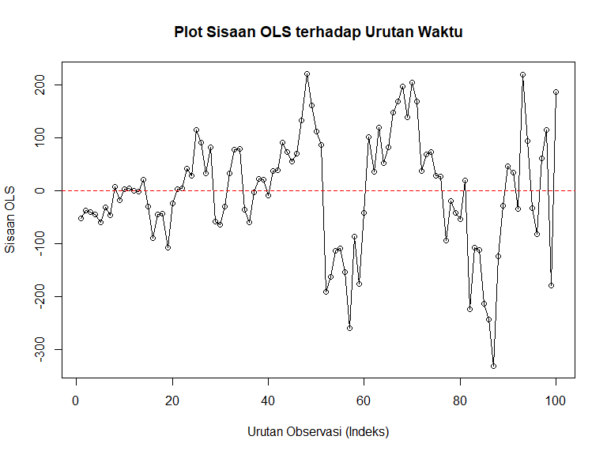
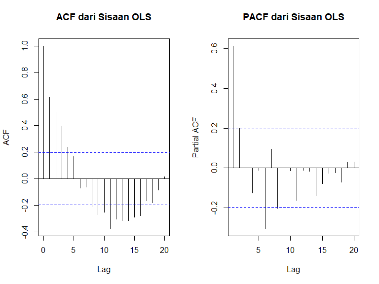
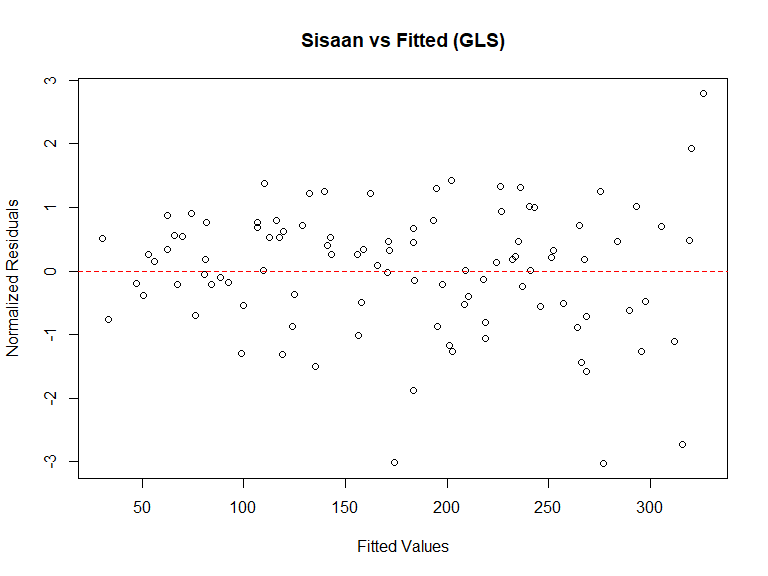
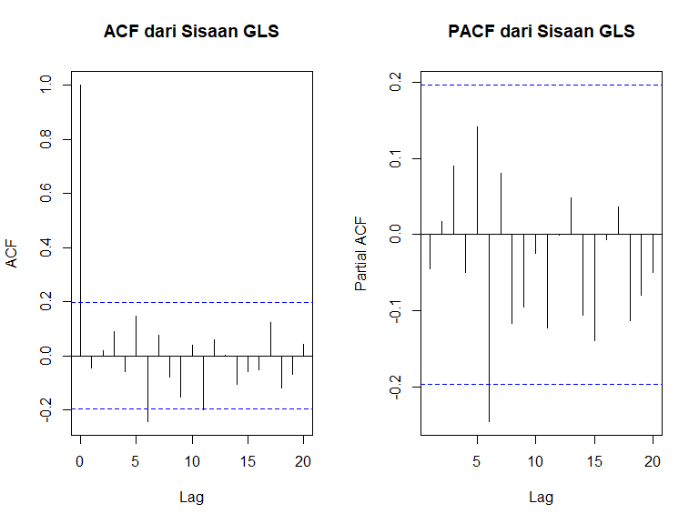
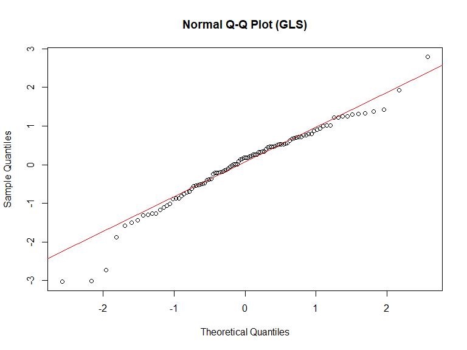

Analisis Regresi Linier dengan GLS
================
Analisis oleh Ferdian Bangkit Wijaya,
2 September 2025.

## Pendahuluan

Dokumen ini melengkapi analisis regresi dengan metode Generalized Least
Squares (GLS). GLS adalah generalisasi dari OLS yang dapat digunakan
untuk menangani masalah baik heteroskedastisitas maupun autokorelasi
pada sisaan.

Fokus utama analisis ini adalah penggunaan GLS untuk mengatasi
autokorelasi, yaitu ketika sisaan dari suatu observasi berkorelasi
dengan sisaan dari observasi lain. Ini adalah masalah umum pada data
yang memiliki urutan, seperti data deret waktu (time series).

## Memuat Paket dan Data

``` r
library(lmtest)
library(car)
library(nlme)
library(readxl)
```

## Mengimpor Data dari File Excel

``` r
# Ganti path file di bawah ini!
file_path <- "C:/Users/user/OneDrive - untirta.ac.id/R Script/Github_Regresi_OLS/data_simulasi_gls.xlsx"
data_GLS <- read_excel(file_path)
data_GLS$time <- 1:nrow(data_GLS)
```

## Menampilkan Data yang diimport

``` r
knitr::kable(head(data_GLS), caption = "Pratinjau 6 Baris Pertama Data")
```

|        y |  x1 |       x2 |       x3 | time |
|---------:|----:|---------:|---------:|-----:|
| 44.24526 |   1 | 63.95721 | 53.70892 |    1 |
| 35.03337 |   2 | 48.54569 | 37.71991 |    2 |
| 47.91869 |   3 | 50.85295 | 48.37802 |    3 |
| 59.39113 |   4 | 49.90594 | 60.88072 |    4 |
| 45.62189 |   5 | 66.81707 | 53.59201 |    5 |
| 76.92317 |   6 | 50.25513 | 60.67191 |    6 |

Pratinjau 6 Baris Pertama Data

## Membangun Model OLS Awal (Untuk Diagnosis)

``` r
# Model OLS sama seperti file sebelumnya
model_ols_awal <- lm(y ~ x1 + x2 + x3, data = data_GLS)
```

## Uji Asumsi Klasik (Diagnostik Sisaan)

``` r
par(mfrow = c(2, 2))
plot(model_ols_awal)
```

<!-- -->

``` r
par(mfrow = c(1, 1))
```

Uji Normalitas (Shapiro-Wilk)

Tujuan: Menguji apakah sisaan model berdistribusi normal.

Hipotesis:

H_0: Sisaan berdistribusi normal.

H_1: Sisaan tidak berdistribusi normal.

Kriteria Keputusan: Tolak H_0 jika p-value \< 0.05. Asumsi normalitas
terpenuhi jika kita gagal menolak H_0 (p-value \> 0.05).

``` r
print(shapiro.test(residuals(model_ols_awal)))
```

    ## 
    ##  Shapiro-Wilk normality test
    ## 
    ## data:  residuals(model_ols_awal)
    ## W = 0.98311, p-value = 0.2304

Uji Homoskedastisitas (Breusch-Pagan)

Tujuan: Menguji apakah varians dari sisaan konstan (homoskedastisitas)
atau tidak (heteroskedastisitas).

Hipotesis:

H_0: Varians sisaan konstan (homoskedastisitas).

H_1: Varians sisaan tidak konstan (terdapat heteroskedastisitas).

Kriteria Keputusan: Tolak H_0 jika p-value \< 0.05. Asumsi
homoskedastisitas terpenuhi jika kita gagal menolak H_0 (p-value \>
0.05).

``` r
print(bptest(model_ols_awal))
```

    ## 
    ##  studentized Breusch-Pagan test
    ## 
    ## data:  model_ols_awal
    ## BP = 20.185, df = 3, p-value = 0.0001554

Uji Autokorelasi (Durbin-Watson)

Tujuan: Menguji apakah ada korelasi antar sisaan pada observasi yang
berdekatan. Autokorelasi umumnya menjadi masalah pada data deret waktu
(time series).

Hipotesis:

H_0: Tidak ada autokorelasi (koefisien autokorelasi = 0).

H_1: Terdapat autokorelasi.

Kriteria Keputusan: Tolak H_0 jika p-value \< 0.05. Asumsi independensi
sisaan terpenuhi jika kita gagal menolak H_0 (p-value \> 0.05).

``` r
print(dwtest(model_ols_awal))
```

    ## 
    ##  Durbin-Watson test
    ## 
    ## data:  model_ols_awal
    ## DW = 0.74077, p-value = 5.116e-11
    ## alternative hypothesis: true autocorrelation is greater than 0

Uji Multikolinearitas (VIF)

Tujuan: Mendeteksi adanya korelasi yang tinggi antar variabel
independen.

Hipotesis: Uji VIF tidak menggunakan hipotesis H_0/H_1 dan p-value.

Kriteria Keputusan: Menggunakan aturan praktis (rule of thumb). Nilai
Variance Inflation Factor (VIF) \> 5 atau 10 mengindikasikan adanya
masalah multikolinearitas.

Harapan: Nilai VIF untuk setiap variabel independen di bawah 5.

``` r
print(vif(model_ols_awal))
```

    ##       x1       x2       x3 
    ## 1.007994 1.002954 1.010958

## Diagnosis Visual Autokorelasi

Pola non-acak pada plot sisaan mengindikasikan adanya autokorelasi.

``` r
# Simpan sisaan ke dalam variabel baru
sisaan_ols <- residuals(model_ols_awal)

# Plot sisaan terhadap indeks yang panjangnya dijamin sama.
# Ini akan mencegah error jika ada data NA yang dihilangkan oleh lm().
plot(1:length(sisaan_ols), sisaan_ols, type = 'o',
     xlab = "Urutan Observasi (Indeks)",
     ylab = "Sisaan OLS",
     main = "Plot Sisaan OLS terhadap Urutan Waktu")
abline(h = 0, col = "red", lty = 2)
```

<!-- -->

Untuk menentukan orde dari proses autokorelasi (misalnya, AR(1), AR(2),
dll.), kita gunakan plot ACF dan PACF pada sisaan model OLS.

ACF (Autocorrelation Function): Menunjukkan korelasi antara sisaan
dengan nilai-nilai lag-nya.

PACF (Partial Autocorrelation Function): Menunjukkan korelasi antara
sisaan dengan nilai lag-nya setelah menghilangkan efek dari lag-lag
perantara.

Aturan Identifikasi untuk Proses Autoregresif (AR):

Plot ACF: Akan menunjukkan pola menurun secara perlahan (tails off /
meluruh).

Plot PACF: Akan menunjukkan lonjakan (spike) signifikan hingga lag ke-p,
lalu tiba-tiba berhenti (cuts off). Jumlah lonjakan signifikan
menunjukkan orde AR(p).

``` r
# Dapatkan sisaan dari model OLS awal
sisaan_ols <- residuals(model_ols_awal)

# Atur layout plot menjadi 1 baris, 2 kolom
par(mfrow = c(1, 2))

# Buat plot ACF dan PACF
acf(sisaan_ols, main = "ACF dari Sisaan OLS")
pacf(sisaan_ols, main = "PACF dari Sisaan OLS")
```

<!-- -->

``` r
# Kembalikan layout ke default
par(mfrow = c(1, 1))
```

Pola gabungan dari ACF yang meluruh dan PACF yang berhenti setelah lag 1
adalah tanda klasik dari proses Autoregresif Orde 1 (AR(1)).

## Pemodelan GLS dengan Struktur Korelasi AR(p)

Berdasarkan bukti kuat dari analisis ACF/PACF, kita sekarang sangat
yakin untuk menggunakan struktur korelasi corAR1() dalam model GLS kita.

``` r
# Membangun model GLS dengan struktur korelasi AR(1)
model_gls <- gls(y ~ x1 + x2 + x3,
                       data = data_GLS,
                       weights = varFixed(~x1),
                       correlation = corAR1(form = ~time))
# Menampilkan ringkasan model GLS
summary(model_gls)
```

    ## Generalized least squares fit by REML
    ##   Model: y ~ x1 + x2 + x3 
    ##   Data: data_GLS 
    ##        AIC      BIC    logLik
    ##   1114.512 1129.898 -551.2558
    ## 
    ## Correlation Structure: AR(1)
    ##  Formula: ~time 
    ##  Parameter estimate(s):
    ##       Phi 
    ## 0.7411009 
    ## Variance function:
    ##  Structure: fixed weights
    ##  Formula: ~x1 
    ## 
    ## Coefficients:
    ##                  Value Std.Error   t-value p-value
    ## (Intercept) -13.134945  31.86651 -0.412187  0.6811
    ## x1            2.704892   0.61493  4.398704  0.0000
    ## x2           -0.579660   0.24559 -2.360311  0.0203
    ## x3            1.764696   0.42832  4.120035  0.0001
    ## 
    ##  Correlation: 
    ##    (Intr) x1     x2    
    ## x1 -0.331              
    ## x2 -0.492  0.103       
    ## x3 -0.740  0.098 -0.003
    ## 
    ## Standardized residuals:
    ##        Min         Q1        Med         Q3        Max 
    ## -2.6228241 -0.4967329  0.1501300  0.7665890  1.9164083 
    ## 
    ## Residual standard error: 15.24417 
    ## Degrees of freedom: 100 total; 96 residual

Nilai “Phi” pada output adalah estimasi parameter AR(1). Nilainya yang
signifikan mengkonfirmasi keputusan kita.

## Validasi Ulang Model GLS

Kita periksa sisaan dari model GLS untuk memastikan pola autokorelasi
sudah hilang.

``` r
sisaan_gls <- residuals(model_gls, type = "normalized")
fitted_gls <- fitted(model_gls)
```

Validasi Heteroskedastisitas

``` r
plot(fitted_gls, sisaan_gls,
     main = "Sisaan vs Fitted (GLS)",
     xlab = "Fitted Values", ylab = "Normalized Residuals")
abline(h = 0, col = "red", lty = 2)
```

<!-- -->

Plot ini seharusnya menunjukkan sebaran titik yang acak (homoskedastis),
menandakan argumen weights berhasil bekerja.

Validasi Autokorelasi

Sama seperti heteroskedastisitas, validasi terbaik untuk autokorelasi
adalah melihat plot ACF/PACF dari sisaan yang sudah dikoreksi.

``` r
par(mfrow = c(1, 2))
acf(sisaan_gls, main = "ACF dari Sisaan GLS")
pacf(sisaan_gls, main = "PACF dari Sisaan GLS")
```

<!-- -->

``` r
par(mfrow = c(1, 1))
```

Validasi Normalitas

``` r
# Uji Formal
print(shapiro.test(sisaan_gls))
```

    ## 
    ##  Shapiro-Wilk normality test
    ## 
    ## data:  sisaan_gls
    ## W = 0.9662, p-value = 0.0114

``` r
# Plot Q-Q
qqnorm(sisaan_gls, main = "Normal Q-Q Plot (GLS)")
qqline(sisaan_gls, col = "red")
```

<!-- -->

Validasi Multikolinearitas

``` r
print(vif(model_gls))
```

    ##       x1       x2       x3 
    ## 1.020649 1.010920 1.009825

## Evaluasi Kebaikan Model (Goodness-of-Fit)

``` r
# Ekstrak metrik dari model GLS
aic_gls <- AIC(model_gls)
bic_gls <- BIC(model_gls)
loglik_gls <- logLik(model_gls)

# Membuat tabel evaluasi untuk model GLS
evaluasi_gls <- data.frame(
  Metrik = c("AIC", "BIC", "Log-Likelihood"),
  Nilai = c(aic_gls, bic_gls, as.numeric(loglik_gls))
)

knitr::kable(evaluasi_gls, caption = "Metrik Kebaikan Model untuk GLS")
```

| Metrik         |     Nilai |
|:---------------|----------:|
| AIC            | 1114.5115 |
| BIC            | 1129.8976 |
| Log-Likelihood | -551.2558 |

Metrik Kebaikan Model untuk GLS
